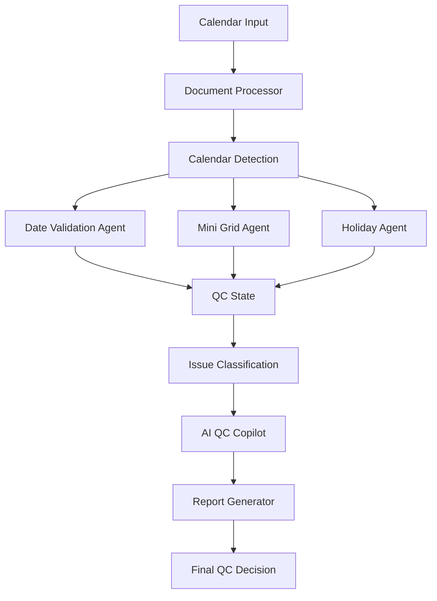
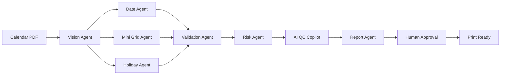

<p align="center">
  
</p>

<div align="center">

# 🩵 Navneet AI ChronoGuard

### AI-Powered Calendar Quality Control, Validation & Pre-Press Intelligence Platform

**Navneet Education Limited**

<br>


<br><br>


<br>

> 🩵 **Intelligent Time · Protected Future · Zero-Defect Calendar Quality Control**

</div>

---

## Project Preview

<a href="https://www.loom.com/share/7cd4870772a04aab86720fe199282856" target="_blank">


</a>

👉 [Click here to watch full screen demo](https://www.loom.com/share/7cd4870772a04aab86720fe199282856)

---

# Overview

Navneet AI ChronoGuard is an advanced AI-powered Calendar Quality Control and Pre-Press Validation platform designed to automate complex calendar verification workflows.

The system helps quality-control, design, production, publishing, and pre-press teams detect calendar errors before files reach final printing.

ChronoGuard combines deterministic calendar mathematics, structured validation rules, holiday-reference datasets, intelligent document processing, AI-assisted analysis, and automated Excel reporting into one centralized quality-control platform.

The system is designed to validate calendar products across multiple years, layouts, pages, regions, and holiday configurations while maintaining detailed audit records.

---

# Core Objectives

ChronoGuard is designed around five major objectives:

- Detect calendar errors automatically
- Reduce repetitive manual QC work
- Improve calendar validation accuracy
- Maintain structured audit evidence
- Prevent costly printing defects

The platform supports both automated intelligence and human quality-control review.

---

# Key Features

## Calendar Quality Control

- Calendar Page Validation
- Month and Year Detection
- Date Sequence Validation
- Weekday Alignment Checking
- Leap-Year Validation
- Date Misplacement Detection
- Missing Date Detection
- Duplicate Date Detection
- Overflow Date Validation
- Month Continuity Verification
- Calendar Structure Analysis
- Spelling and Proofing Checks

---

# Large Language Model (LLM) Integration

Navneet AI ChronoGuard integrates Large Language Models (LLMs) to provide intelligent reasoning, conversational quality-control assistance, anomaly interpretation, and automated report analysis.

The LLM layer works together with the deterministic Calendar Validation Engine. Mathematical calendar rules remain rule-based, while the LLM provides intelligent interpretation and decision-support capabilities.

## LLM Capabilities

- Natural-Language QC Analysis
- Calendar Error Explanation
- Validation Failure Interpretation
- AI-Assisted Anomaly Classification
- QC Report Summarization
- Corrective Action Recommendations
- Holiday Issue Interpretation
- Risk and Severity Analysis
- Natural-Language Question Answering
- Management Summary Generation
- Document Intelligence
- Context-Aware QC Assistance
- Structured JSON Output
- AI Copilot Responses

## LLM Architecture

```text
Calendar / PDF Input
        |
        v
Document Processing
        |
        v
Calendar Validation Engine
        |
        +-------------------+
        |                   |
        v                   v
Rules Engine          RAG Knowledge Layer
        |                   |
        +---------+---------+
                  |
                  v
            LLM Engine
                  |
        +---------+---------+
        |         |         |
        v         v         v
    AI Agent   AI Copilot  Analysis
        |         |         |
        +---------+---------+
                  |
                  v
         Intelligent QC Result
                  |
                  v
         Human QC Approval


## Intelligent Date Validation

ChronoGuard can validate fundamental calendar rules including:

- Correct number of days per month
- January through December continuity
- Correct weekday for each date
- Correct month starting weekday
- Correct month ending weekday
- Sequential date progression
- Leap-year February handling
- Previous-month overflow dates
- Next-month overflow dates
- Sunday and Monday stacked-date rules

---

# Leap-Year Intelligence

ChronoGuard validates February according to Gregorian calendar rules.

```text
Normal Year
February = 28 Days

Leap Year
February = 29 Days
```

Leap-year calculation:

```text
Year divisible by 4
        │
        ▼
Potential Leap Year
        │
        ▼
Divisible by 100?
     /       \
   No         Yes
   │           │
 Leap      Divisible by 400?
              /       \
            Yes        No
             │          │
           Leap      Normal
```

This prevents incorrect February calendars from reaching production.

---

# Sequential Date Validation

The system verifies that dates follow the expected sequence:

```text
1 → 2 → 3 → 4 → 5 → ... → Last Day
```

ChronoGuard detects:

- Missing dates
- Repeated dates
- Broken sequences
- Unexpected numbers
- Incorrect final dates
- Incorrect month transitions

---

# Weekday Placement Validation

Every date is checked against its expected weekday.

Example:

```text
SUN  MON  TUE  WED  THU  FRI  SAT

                 1    2    3    4
 5    6    7     8    9   10   11
12   13   14    15   16   17   18
```

ChronoGuard verifies that each date appears under the mathematically correct weekday column.

---

# Date Misplacement Detection

The system detects situations where a valid date appears under an incorrect weekday.

```text
Expected

Monday → 14

Detected

Tuesday → 14

Result

FAIL
```

This is especially important because visually correct-looking calendars may still contain weekday-placement errors.

---

# Date Alignment QC

ChronoGuard also supports visual and structural checks for calendar alignment.

Validation can include:

- Date-to-weekday alignment
- Grid positioning
- Row consistency
- Column consistency
- Spacing anomalies
- Misaligned date numbers
- Incorrect calendar-cell placement

---

# Slash / Stacked Date Validation

Some calendar designs combine dates inside the same visual cell.

Example:

```text
29/30
```

ChronoGuard validates whether stacked or slash-separated dates follow the required calendar design rules.

The system can flag incorrectly combined dates for manual review.

---

# Overflow Date Validation

Calendar designs may display dates belonging to adjacent months.

ChronoGuard can validate:

- Previous-month dates
- Next-month dates
- Overflow sequence
- Overflow styling
- Non-bold overflow requirements
- Correct transition between months

---

# Spelling & Proofing

Calendar quality control also includes text-level verification.

The system can help review:

- Month names
- Weekday headers
- Holiday names
- Calendar labels
- Reference text
- Typographical errors

---

# Mini Calendar Intelligence

Many printed calendars include small reference calendars or mini-month strips.

ChronoGuard contains dedicated mini-grid quality checks.

## Mini Grid Checks

```text
MG-1  Mini Calendar Detection
MG-2  Date Completeness
MG-3  Weekday Column Placement
MG-4  First-Day Offset
MG-5  Last-Day Integrity
MG-6  Leap-Year Validation
MG-7  Slash / Stacked-Date Validation
MG-8  Cross-Month Continuity
```

---

# MG-1 Mini Calendar Detection

Checks whether all required mini calendars are present.

Expected:

```text
JAN FEB MAR APR MAY JUN
JUL AUG SEP OCT NOV DEC
```

Missing mini-months can be detected and reported.

---

# MG-2 Completeness Validation

Each mini calendar is checked for complete date coverage.

Example:

```text
January

Expected: 1 → 31
Detected: 1 → 30

Result: FAIL
```

---

# MG-3 Weekday Column Validation

Dates inside mini calendars are validated against their expected weekday columns.

This prevents small reference calendars from containing hidden weekday errors.

---

# MG-4 First-Day Offset

ChronoGuard verifies that Day 1 appears in the correct weekday column.

```text
Expected

1 January → Friday

Detected

1 January → Thursday

Result

FAIL
```

---

# MG-5 Last-Day Integrity

The final day of every mini calendar is checked.

Examples:

```text
January  → 31
February → 28 / 29
April    → 30
December → 31
```

---

# MG-6 Mini Calendar Leap-Year Validation

February mini calendars are independently checked for leap-year correctness.

This prevents situations where the main calendar is correct but the mini-calendar reference is wrong.

---

# MG-7 Mini Slash Validation

Stacked dates and slash-separated dates inside mini grids can also be inspected for rule compliance.

---

# MG-8 Cross-Month Continuity

ChronoGuard verifies the complete mini-calendar sequence:

```text
JAN
 ↓
FEB
 ↓
MAR
 ↓
APR
 ↓
MAY
 ↓
JUN
 ↓
JUL
 ↓
AUG
 ↓
SEP
 ↓
OCT
 ↓
NOV
 ↓
DEC
```

---

# Holiday Intelligence

ChronoGuard includes dedicated holiday quality-control functionality.

The system can compare calendar holidays against approved holiday-reference datasets.

Supported validation includes:

- Holiday Name
- Expected Date
- Expected Weekday
- Month
- Calendar Page
- Printed Holiday Text
- Verification Status
- Notes
- Verified By

---

# Holiday Validation Status

```text
Exact Match
Wrong Date
Spelling Error
Not Found
Misplaced - Wrong Month
Extra - Not in Reference
N/A
```

---

# Holiday Reference Data

The project can work with structured Excel holiday datasets covering multiple calendar years.

Example workflow:

```text
Approved Holiday Dataset
          │
          ▼
Reference Normalization
          │
          ▼
Calendar Year Selection
          │
          ▼
Expected Holiday List
          │
          ▼
Calendar Content Extraction
          │
          ▼
Holiday Matching
          │
          ▼
Mismatch Detection
          │
          ▼
QC Report
```

---

# AI QC Agent

ChronoGuard can be extended with an AI Quality-Control Agent that acts as an intelligent assistant for calendar validation.

The agent can assist with:

- Understanding detected QC issues
- Explaining validation failures
- Summarizing audit results
- Classifying anomalies
- Prioritizing defects
- Generating corrective-action suggestions
- Creating management summaries
- Interpreting QC reports
- Answering natural-language questions

---

# AI Copilot

The AI Copilot layer provides conversational access to quality-control intelligence.

Example questions:

```text
Why did February fail validation?

Show all critical errors.

Which months have weekday-placement problems?

Find missing holidays.

Summarize the QC report.

Which pages require correction?

Explain the mini-calendar errors.

Is this calendar safe for final printing?
```

---

# RAG Intelligence

ChronoGuard can use Retrieval-Augmented Generation to provide context-aware AI assistance.

```text
User Question
      │
      ▼
Query Processing
      │
      ▼
Reference Documents
      │
      ▼
Holiday Data
      │
      ▼
QC Rules
      │
      ▼
Vector / Keyword Retrieval
      │
      ▼
Relevant Context
      │
      ▼
AI Reasoning
      │
      ▼
Grounded Response
```

---

# LangChain Integration

LangChain can orchestrate:

- Document processing
- Prompt construction
- Context retrieval
- AI model communication
- Structured output
- Tool execution
- Retrieval workflows

---

# LangGraph Agent Workflow

LangGraph can provide stateful multi-step QC agent execution.



---

# Intelligent QC Architecture

```text
                    Calendar Input
                          │
                          ▼
                 Document Processing
                          │
          ┌───────────────┼───────────────┐
          │               │               │
          ▼               ▼               ▼
      Main Grid       Mini Grids       Holidays
          │               │               │
          ▼               ▼               ▼
    Date Checker     Mini Checker    Holiday Checker
          │               │               │
          └───────────────┼───────────────┘
                          │
                          ▼
                  Validation Engine
                          │
                          ▼
                  Issue Classifier
                          │
             ┌────────────┴────────────┐
             │                         │
             ▼                         ▼
        AI QC Agent              Rules Engine
             │                         │
             └────────────┬────────────┘
                          │
                          ▼
                     QC Results
                          │
             ┌────────────┼────────────┐
             │            │            │
             ▼            ▼            ▼
         Dashboard     Excel Report   Issues Log
```

---

# End-to-End Workflow

```text
Upload Calendar
      │
      ▼
Identify Calendar Year
      │
      ▼
Detect Calendar Pages
      │
      ▼
Extract Calendar Information
      │
      ▼
Validate Main Date Grid
      │
      ├── Leap Year
      ├── Sequential Dates
      ├── Date Misplacement
      ├── Alignment
      ├── Slash / Stacked Dates
      ├── Overflow Dates
      └── Spelling
      │
      ▼
Validate Mini Calendars
      │
      ├── Detection
      ├── Completeness
      ├── Column Placement
      ├── First Day
      ├── Last Day
      ├── Leap Year
      ├── Slash Rules
      └── Continuity
      │
      ▼
Validate Holidays
      │
      ▼
Classify Issues
      │
      ▼
Generate QC Report
      │
      ▼
Human Review
      │
      ▼
Final Approval
```

---

# QC Status System

ChronoGuard uses standardized QC states.

| Status | Meaning |
|--------|---------|
| PASS | Validation successful |
| FAIL | Error detected |
| WARN | Review recommended |
| N/A | Check not applicable |

---

# Issue Severity

Detected problems can be classified as:

```text
CRITICAL
HIGH
MEDIUM
LOW
```

Issue lifecycle:

```text
Open
  │
  ▼
In Progress
  │
  ▼
Fixed
  │
  ▼
Verified
```

---

# Calendar QC Report

ChronoGuard includes a structured Excel-based QC reporting system.

The report can contain:

```text
Calendar QC Report
│
├── Cover
│
├── QC Checklist
│
├── Issues Log
│
├── Holiday Check
│
└── Instructions
```

---

# Cover Sheet

The Cover sheet can capture:

- Product / SKU Code
- Calendar Name
- Calendar Year
- Design Type
- Number of Pages
- Auditor Name
- Audit Date
- Company / Client
- Project Reference
- Overall Audit Status

---

# QC Checklist

The QC Checklist records one row per calendar page.

Major groups include:

```text
PAGE INFORMATION

MAIN CALENDAR CHECKS

MINI REFERENCE STRIP CHECKS

RESULT
```

---

# Issues Log

Every FAIL or WARN can be documented with detailed information.

Fields include:

- Issue Number
- Page Number
- Month / Year
- Design Type
- Checker
- Check Name
- Mini Month
- Error Description
- Severity
- Action Required
- Responsible Person
- Status

---

# Holiday Check Report

Holiday validation is maintained separately for easier review.

Fields include:

- Holiday Name
- Expected Date
- Expected Day
- Month
- Page Number
- Text Found
- Status
- Notes
- Verified By

---

# Supported Calendar Designs

ChronoGuard can support multiple calendar layouts such as:

```text
Year-View 36x24

Portrait 22x29

Portrait 12x17

Landscape 11x8

Three-Month 12x27

Deskpad 18x11

Deskpad 22x17

Other
```

---

# Dashboard

The ChronoGuard dashboard can provide a centralized view of calendar QC operations.

Possible dashboard metrics include:

- Total Calendar Pages
- Pages Passed
- Pages Failed
- Warning Count
- Critical Errors
- Holiday Errors
- Mini Calendar Errors
- Date Errors
- Overall QC Score
- Audit Completion Status

---

# QC Analytics

Management-level analytics can include:

```text
Total Checks
Passed Checks
Failed Checks
Warnings
Pass Percentage
Failure Percentage
Issues by Category
Issues by Severity
Issues by Month
Issues by Calendar Design
Holiday Accuracy
Mini-Grid Accuracy
```

---

# Excel Automation

ChronoGuard uses OpenPyXL-based automation for structured QC reports.

Capabilities include:

- Workbook generation
- Styled report sheets
- Status dropdowns
- Data validation
- Structured tables
- Audit forms
- Issue tracking
- Holiday verification
- Color-coded status architecture

---

# Document Processing

The project stack supports document-processing libraries for handling calendar documents and reports.

Potential processing pipeline:

```text
PDF / Calendar File
        │
        ▼
PyMuPDF / PDFPlumber
        │
        ▼
Text + Layout Extraction
        │
        ▼
Calendar Structure Detection
        │
        ▼
Validation Engine
```

---

# Intelligent Matching

RapidFuzz and related matching techniques can support fuzzy text comparison.

Useful applications include:

- Holiday spelling matching
- Month-name matching
- OCR correction assistance
- Reference-data matching
- Similar text detection

---

# Technology Stack

| Layer | Technology |
|------|------------|
| Programming Language | Python |
| Web Application | Streamlit |
| Data Processing | Pandas |
| Numerical Processing | NumPy |
| Excel Automation | OpenPyXL |
| PDF Processing | PyMuPDF |
| PDF Extraction | PDFPlumber |
| Validation | Pydantic |
| Fuzzy Matching | RapidFuzz |
| LLM | Configurable Large Language Model |
| LLM API | OpenAI-Compatible API |
| LLM Gateway | OpenRouter |
| AI Framework | LangChain |
| AI Agents | LangGraph |
| AI Copilot | LLM + RAG |
| Retrieval | BM25 / RAG |
| Machine Learning | Scikit-learn |
| Date Processing | Python Date Utilities |
| Calendar Conversion | Convertdate |
| Hijri Calendar | Hijridate |
| Deployment | Docker |
| Production Server | Gunicorn |

---

# Project Structure

```text
Navneet-AI-ChronoGuard/
│
├── index1.py
├── make_template.py
├── requirements.txt
│
├── Dockerfile
├── docker-compose.yml
├── .dockerignore
│
├── pages/
│   ├── dashboard.py
│   ├── calendar_qc.py
│   ├── holiday_check.py
│   ├── issues.py
│   ├── reports.py
│   └── ai_copilot.py
│
├── data/
│   ├── holidays_2016_2029_ready.xlsx
│   ├── Holidays_2027_2028.xlsx
│   ├── holidays_2028.xlsx
│   └── holiday_reference.xlsx
│
├── reports/
│   └── Calendar_QC_Report_Template.xlsx
│
├── utils/
│   ├── calendar_engine.py
│   ├── holiday_engine.py
│   ├── mini_grid_checker.py
│   ├── report_generator.py
│   └── validators.py
│
├── ai/
│   ├── agent.py
│   ├── copilot.py
│   ├── rag.py
│   └── prompts.py
│
└── README.md
```

> Note: The structure above represents the recommended full production organization of the ChronoGuard platform. Adapt module names to match your repository if your current implementation keeps components in fewer files.

---

# Requirements

Core Python packages include:

```txt
pandas
numpy
openpyxl
pdfplumber
pymupdf
pydantic
jinja2
rapidfuzz
matplotlib
openai
scikit-learn
streamlit
flask
werkzeug
gunicorn
requests
Pillow
python-dateutil
langchain
langchain-openai
langchain-community
langgraph
rank_bm25
convertdate
hijridate
```

---

# Installation

## Clone Repository

```bash
git clone https://github.com/yourusername/Navneet-AI-ChronoGuard.git
```

Enter the project directory:

```bash
cd Navneet-AI-ChronoGuard
```

---

# Create Virtual Environment

Windows:

```bash
python -m venv .venv
.venv\Scripts\activate
```

Linux / macOS:

```bash
python3 -m venv .venv
source .venv/bin/activate
```

---

# Install Dependencies

```bash
pip install -r requirements.txt
```

---

# Run Application

If `index1.py` is the Streamlit entry point:

```bash
streamlit run index1.py
```

Then open the local Streamlit address displayed in the terminal.

---

# Generate QC Excel Template

The project includes an automated Excel QC template generator.

Run:

```bash
python make_template.py
```

The script generates:

```text
Calendar_QC_Report_Template.xlsx
```

---

# Docker Deployment

Build and start the application:

```bash
docker compose up --build
```

Run in background:

```bash
docker compose up -d --build
```

View running containers:

```bash
docker compose ps
```

Stop:

```bash
docker compose down
```

---

# AI Configuration

For AI-enabled deployments, keep credentials in environment variables.

Example:

```env
OPENAI_API_KEY=your_api_key_here
OPENROUTER_API_KEY=your_api_key_here
AI_MODEL=your_model_name
```

Never commit production API keys to GitHub.

Add secrets to `.gitignore`:

```gitignore
.env
.env.*
*.key
secrets/
```

---

# Quality-Control Philosophy

ChronoGuard follows a simple principle:

```text
Detect Early
     │
     ▼
Validate Automatically
     │
     ▼
Review Intelligently
     │
     ▼
Correct Before Production
     │
     ▼
Zero-Defect Calendar Output
```

---

# Enterprise Benefits

## Quality Teams

- Faster QC cycles
- Structured checklists
- Consistent validation
- Better issue traceability

## Design Teams

- Faster identification of calendar errors
- Clear correction instructions
- Reduced repetitive checking

## Production Teams

- Reduced printing risk
- Better pre-press confidence
- Fewer costly reprints

## Management

- Centralized quality visibility
- Structured audit reporting
- QC performance metrics
- Better accountability

---

# Security & Governance

Recommended enterprise controls include:

- Role-Based Access Control
- Secure authentication
- Environment-based secrets
- Audit logs
- User activity tracking
- Controlled reference datasets
- QC approval workflow
- Report versioning
- Secure document storage

---

# Future Enhancements

- AI Vision Calendar Detection
- Advanced OCR Integration
- Multi-Agent QC Architecture
- Automatic PDF Annotation
- Visual Bounding-Box Error Detection
- AI Correction Recommendations
- Automatic Holiday Extraction
- Multi-Language Calendar Validation
- Indian Regional Calendar Support
- Hijri Calendar Validation
- International Holiday Validation
- Automatic Proof Comparison
- Version-to-Version Calendar Comparison
- AI Risk Scoring
- Automated Email QC Reports
- Management Analytics Dashboard
- REST API
- ERP Integration
- Pre-Press Workflow Integration
- Cloud Deployment
- PostgreSQL Support
- Enterprise SSO
- Mobile QC Application

---

# AI Agent Roadmap



---

# Developer

## SNEHAL LAXMAN JADHAV

### AI Engineer

### Navneet Education Limited

Developed as an AI engineering initiative focused on intelligent calendar validation, automated quality control, document intelligence, AI-assisted pre-press workflows, and enterprise automation.

---

<div align="center">

# Navneet AI ChronoGuard

### Intelligent Time. Protected Future.

### AI-Powered Calendar Quality Control for Zero-Defect Production

<br>

**AI • Calendar Intelligence • Quality Control • Pre-Press • Automation**

<br>


<br>

### Detect. Validate. Protect. Print.

</div>

<p align="center">

</p>
